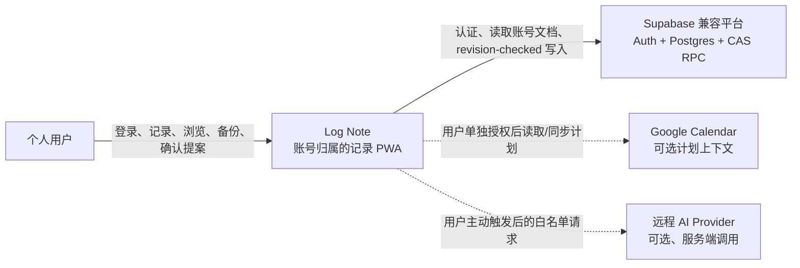
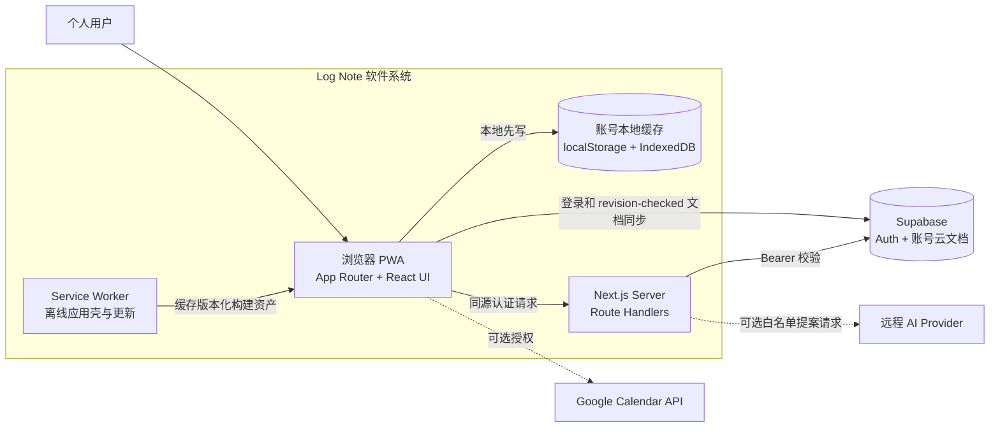

# Log Note 软件架构

结论：Log Note 以 Next.js App Router 为应用骨架，以账号隔离和本地优先为数据边界，以受限提案协议接入 AI；任何功能只能扩展现有规范实现，不能创建第二套路由、状态或持久化链路。

本文采用 [arc42 9.0](https://arc42.org/) 的十二章结构，并按其精简原则只记录对当前项目有维护价值的内容。图采用工具无关的 [C4 模型](https://c4model.com/)语义，以 Mermaid 保持可版本化和直接阅读。重要决策单独使用 [MADR 4.0](https://adr.github.io/madr/) 保存。arc42 模板采用 CC BY-SA 4.0；本文中的 Log Note 项目内容仍由本项目维护。

## 1. 引言与目标

### 1.1 需求概览

Log Note 是账号归属、可离线使用、移动端优先的安静记录工具。架构首先支持以下核心闭环：

```text
quick record → browse → search → edit/delete → backup/restore → offline use
```

完整产品行为以 [`product.md`](product.md) 为准；任务优先级、依赖、状态和验收证据只以 [`PROJECT_BOARD.md`](PROJECT_BOARD.md) 为准。本文描述当前系统如何实现这些行为，不创建新的产品范围。

### 1.2 最高质量目标

| 优先级 | 质量目标 | 可观察结果 |
| --- | --- | --- |
| 1 | 账号数据隔离 | 切换账号不会读取、上传、清理或复用其他账号的文字和图片 |
| 2 | 本地优先与离线连续性 | 已认证设备断网后仍可记录、浏览、搜索、编辑和删除；文字修改先本地生效 |
| 3 | 原始记录完整与可恢复 | AI、迁移和派生功能不静默改写原文；无效输入不覆盖当前数据；备份保持兼容 |
| 4 | 快速记录 | 普通记录保持“一次打开、输入后再一次保存”的上限，模板和高级结构不是必选步骤 |
| 5 | 可审查的演进 | 人和开发 Agent 能定位唯一实现、明确变更边界，并用聚焦回归和完整门禁验证结果 |

### 1.3 利益相关者与真源

| 角色 | 需要从项目知识中得到什么 | 权威来源 |
| --- | --- | --- |
| 产品负责人兼主要用户 | 长期产品边界、当前优先级、真实验收状态 | `product.md`、`PROJECT_BOARD.md` |
| 开发者与开发 Agent | 操作权限、当前技术结构、变更规格、验证方式 | `AGENTS.md`、本文、当前 `specs/<feature>/`、代码与测试 |
| 产品内运行时 Agent | 允许读取的数据、可返回的提案、确认和失效规则 | 本文第 6、8、10 章及当前功能规格 |
| 运维与发布人员 | 可复现构建、部署边界、健康检查和待验证外部证据 | `ops/`、`.github/workflows/`、`PROJECT_BOARD.md` |

每个真源只回答一种问题：

- `AGENTS.md`：如何工作、能做什么、何时算完成。
- `product.md`：产品必须保持什么行为。
- `ARCHITECTURE.md`：系统现在如何组成、运行和受约束。
- `docs/decisions/`：为什么选择某个重要架构方案。
- `specs/<feature>/`：一个已登记板项准备改变什么；`spec.md` 是该变更的 Living Spec，`plan.md` 和 `tasks.md` 是派生执行材料。
- `PROJECT_BOARD.md`：先做什么、当前处于什么状态、已有和缺失哪些证据。
- 当前代码与测试：已经实现的事实；它们不能替代产品批准或外部验收。

## 2. 架构约束

### 2.1 约束优先级

代码和目录按以下顺序决策：

1. [Next.js App Router](https://nextjs.org/docs/app) 的路由、布局、Route Handler、Server Component 和 Client Component 约定。
2. Log Note 的账号隔离、离线可用、本地先写、revision 冲突保护、原文完整和备份兼容等产品不变量。
3. 功能内聚、单向依赖和最小公开入口；在 `src/app` 外使用轻量领域模块与基础设施分层，不建立与 App Router 冲突的第二套路由层级。

因此，不为 FSD 创建 `src/pages` 层，也不把 `page.js`、`layout.js` 或 `route.js` 移出 `src/app`。该选择记录于 [ADR-0001](docs/decisions/0001-nextjs-app-router-before-fsd.md)。

### 2.2 技术与组织约束

- 支持的应用基线是 Next.js 15、React 19 和移动端优先 PWA。Mastra-enabled 服务端路径要求 Node.js `>=22.13.0`；个人腾讯发布已使用 Node 22，内部 Plus/Cargo/CatPaw 仍是 Node 20，升级或发行隔离完成前不得合入该路径。
- 第一次使用需要真实的 Supabase 兼容账号；离线能力只延续已经认证且有账号缓存的设备。
- 文字、计划、结构和设置进入账号隔离的浏览器缓存，并通过 revision-checked 写入同步；图片 Blob 留在账号命名空间内的 IndexedDB 和便携备份中。
- 密钥、服务端认证和远程模型调用只允许存在于 Route Handler 或明确的 server-only 适配器中。
- 未获批准的远程 AI、社交、通用任务平台或插件能力不得进入主记录路径。
- 一个主工作区同时只允许一个写入者；不得覆盖未纳入当前写集的用户改动。

## 3. 上下文与范围

### 3.1 C4 系统上下文



虚线表示可选集成；它们不可成为普通记录和离线使用的前置条件。

### 3.2 外部接口与数据边界

| 外部对象 | Log Note 发送或接收什么 | 边界 |
| --- | --- | --- |
| Supabase 兼容平台 | 登录身份、每账号一份版本化文字文档、expected revision | RLS 和 CAS 必须生效；图片、Google token 与私密诊断不得进入云文档 |
| Google Calendar | 用户单独授权后的日历事件和带标记的计划同步 | token 只在页面内存；外部事件只读；不进入 Supabase 和备份 |
| 远程 AI Provider | 当前功能规格允许的白名单、截断后的请求 | 只能返回未受信任提案；不能获得账号凭据、图片、整份文档或直接写权限 |
| 部署平台 | 构建产物、环境配置、健康检查 | 发布状态和真实环境证据以 `PROJECT_BOARD.md` 为准，不从配置文件推断成功 |

系统范围包含浏览器 PWA、同源 Next.js Route Handler、Service Worker、Supabase 迁移和仓库内发布契约；不包含 Supabase、Google、模型平台或云主机自身的内部实现。

## 4. 解决方案策略

| 驱动目标 | 解决策略 | 主要落点 |
| --- | --- | --- |
| 路由和模块可预测 | App Router 特殊文件留在 `src/app`，私有 UI 就近共置，共享 UI 只提升到最窄稳定入口 | `src/app/**`、[ADR-0001](docs/decisions/0001-nextjs-app-router-before-fsd.md) |
| 离线响应与账号隔离 | `commitData` 先更新账号作用域本地状态，再延迟同步；账号切换使用新的 generation 隔离异步结果 | `log-note-data-provider.js`、`account-sync.mjs`、`storage-state.mjs` |
| 防止跨设备覆盖 | 云写入携带 expected revision；stale revision 停写并进入显式冲突处理 | `cloud-document-client.js`、`cloud-document.mjs`、Supabase RPC |
| AI 可移除、失败零写入 | 浏览器只请求同源 Route Handler；各类远程 AI（包括独立的当前领域今日总结）的模型执行统一隔离在无工具、无 Agent 记忆的 Mastra adapter，业务归一化、差异预览、显式确认、陈旧性复核和一次原子提交仍归 Log Note | `src/modules/`、`src/infrastructure/ai/`、`src/mastra/`、第 6.3、8.2 节及功能规格 |
| 数据可恢复 | 完整 JSON 和便携附件备份保留版本与兼容校验；非法或旧输入不能直接替换当前 payload | `attachment-bundle.mjs`、`data.mjs`、设置工作面 |
| 知识可维护 | arc42 描述系统现状，C4 描述视图，MADR 保存理由，Spec Kit 管理一次变更 | [ADR-0002](docs/decisions/0002-arc42-c4-madr-with-spec-kit.md) |

## 5. 构建块视图

### 5.1 C4 容器视图



### 5.2 源码构建块

| 构建块 | 责任 | 公开边界 |
| --- | --- | --- |
| `src/app/**/page.js`、`layout.js` | 路由入口、布局、元数据和页面级组装 | Next.js App Router 约定 |
| `src/app/**/route.js` | App Router HTTP 入口与依赖组装；只选择认证、限流和 capability handler | 同源 HTTP 接口 |
| `src/app/<route>/_components/` | 仅属于该路由或工作面的交互实现 | 目录 `index.js` 暴露的最小入口 |
| `src/app/_components/` | 多个 app 工作面复用的 React UI | 共享目录 `index.js` |
| `src/app/log-note-data-provider.js` 及账号 Provider | 账号会话、本地提交、同步状态和冲突编排 | hooks/context，不被下层模块反向依赖 |
| `src/modules/**` | 按真实业务能力归属的 UI 无关规则、schema、用例和浏览器/服务端适配 | capability 的 `model`、`client`、`server` 就近共置；可依赖 `shared` 和 `infrastructure`，禁止依赖 `app` 或直接依赖 Mastra |
| `src/shared/**` | 跨业务复用且不含具体业务语义的协议、约束与纯规则 | 不依赖 `app`、`modules`、`infrastructure` 或 Mastra |
| `src/infrastructure/**` | Supabase、DeepSeek 与 Mastra 等外部技术适配 | 可依赖 `shared` 和专用框架入口；禁止依赖 `app` 或业务模块 |
| `src/lib/` | 尚未按真实所有权迁移的旧 UI 无关模块 | 仅作渐进迁移兼容区；不得接收新的业务 capability，也禁止反向依赖 `src/app` |
| `src/mastra/` | 组合固定 capability 的瞬态 Agent/Workflow，执行一次结构化生成后调用注入的项目归一化函数 | 仅框架 adapter；不得拥有鉴权、业务 allowlist、工具、Agent 记忆、应用持久化、写入或独立 HTTP 服务；Workflow snapshot 明确关闭 |
| `public/sw.js` | 版本化应用壳缓存、离线加载和受控更新 | Service Worker 生命周期 |
| `supabase/migrations/` | 账号文档、RLS/CAS 数据库契约 | 版本化 SQL 迁移 |
| `ops/`、`.github/workflows/` | 可复现构建、发布、健康检查和回滚契约 | 不代表真实部署已经验收 |

### 5.3 当前目录地图

```text
AGENTS.md                                  # Agent 操作、权限与完成规则
PROJECT_CONTEXT.md                         # 稳定系统地图、接口导航与迭代契约
product.md                                # 长期产品行为
PROJECT_BOARD.md                          # 优先级、状态和验收证据
ARCHITECTURE.md                           # arc42 当前技术基线
docs/decisions/                           # MADR 决策日志
specs/<feature>/                          # 一个既有板项的 Living Spec 与派生材料

src/
├── app/
│   ├── layout.js                         # 根布局与应用级 Provider 组装
│   ├── page.js                           # 首页路由入口与主流程编排
│   ├── **/route.js                       # HTTP / AI Route Handler
│   ├── _components/recording/            # app 内共享记录输入 UI
│   ├── settings/
│   │   └── _components/record-setup/     # 设置工作面拥有的记录设置实现
│   └── templates/page.js                 # 旧 URL 的兼容重定向
├── modules/                              # 可脱离路由运行的业务能力
│   ├── assistant/review/                 # 日记与 Plan 分析/回复
│   ├── organize/{classification,daily-review}/
│   ├── insights/{analytics,domain-review,domain-daily-summary,calendar-diary-review}/
│   └── composer/content-improvement/     # 草稿内容优化
├── shared/
│   ├── ai/                               # 通用 AI HTTP/客户端协议与限流
│   └── auth/                             # 纯鉴权规则
├── infrastructure/
│   ├── ai/                               # DeepSeek Provider、Mastra 执行与错误转换
│   └── auth/                             # Supabase 浏览器 client 与服务端 token 校验
├── lib/                                  # 待按真实所有权渐进迁移的旧模块
└── mastra/                               # 远程 AI capability 共用的可替换执行 adapter

tests/                                    # Node 单元与结构回归
e2e/                                      # 移动端、PWA、离线与真实交互回归
```

## 6. 运行时视图

只保留下列对质量目标或外部边界关键的场景；普通组件内部调用由代码和聚焦测试说明。

### 6.1 普通记录保存与同步

```text
既有记录正文 → HomeRecordViews 当前行 → RecordComposer inline 草稿
既有记录时间 → RecordTimeEditor → mergeRecordTime 只生成 time 差异
新建记录 → DialogSurface → RecordComposer 新草稿
  → 用户显式确认保存
  → UI 校验当前草稿
  → commitData 生成新的账号内状态
  → 账号作用域 localStorage 立即持久化
  → UI 使用新状态继续工作
  → debounce 云同步读取当前 revision
  → Supabase CAS RPC 写入 expected revision
  → 成功：更新 revision
  → 冲突：暂停同步并要求用户显式选择，不覆盖远端
```

正文行内编辑与时间浮层是互斥的瞬态 UI 状态，只由 `page.js` 编排；取消、Escape、浮层外点击、日期/视图/工具上下文切换均丢弃草稿且不进入 `commitData`。`RecordComposer` 继续是正文、结构化字段、更多详情、附件、Hero 提案和删除回调的唯一表单实现，inline 只改变呈现位置；`mergeRecordTime` 则锁定时间保存只能替换 `entry.time`。这两条路径不新增 store、持久化键、schema 或同步入口。

图片附件先写入当前账号命名空间的 IndexedDB；云文档只保存允许的图片引用元数据，不上传 Blob。

### 6.2 模板设置与渲染

```text
/settings/page.js 或首页内嵌设置
  → SettingsPage
  → RecordSetupManager
  → RecordSetupScreen
  → commitData
  → LogNoteDataProvider
  → 本地持久化
  → 延迟的 revision-checked 云同步

RecordComposer / FixedRecords
  → app/_components/recording
  → StructuredFields

/templates/page.js
  → 重定向到 /settings#record-setup
```

模板目录调整只改变模块所有权，不改变模板数据结构、拖拽与键盘排序、字段输入、历史记录的 `categoryId` 关联、备份格式或兼容 URL。移动模板到其他分类会更新相关历史记录的 `categoryId`；这属于现有产品行为，不得由目录重构或 AI 提案静默改变。

### 6.3 运行时 AI 提案与写入

现有远程 AI——Diary 分析/回复、Plan 分析/回复、单日时间梳理、Google 日历与今日记录复盘、现有分类整理、七日领域总结、当前领域今日总结、普通草稿内容优化——共用以下服务端执行链：

```text
/api/organize/{agent|review|analyze|day-review|domain-review|domain-daily-summary} 或 /api/records/improve Route Handler
  → `src/infrastructure/auth/supabase-access-token.mjs` 使用 Supabase Auth 校验 bearer token
  → 对应 `src/modules/**/server.mjs` 完成同源/体积/schema 校验、输入裁剪和业务归一化
  → `src/shared/ai/` 提供通用请求协议与进程内限流
  → `src/infrastructure/ai/` 统一 Provider、公开错误转换、20s timeout 与 512 KiB response bound
  → src/mastra 按固定 capability 创建无工具、无 Agent 记忆的 request-scoped Agent
  → transient Workflow: strict structured generation → injected project normalizer
  → 对应项目 model 复核 ID allowlist、互斥结果、排序或总结安全边界
  → 浏览器只接收 inert proposal / session-only summary / classification result / draft candidate
  → Diary/Plan 提案显式确认后进入既有 commitData / undo；内容优化只替换未保存草稿，仍由原有 Done 进入 commitData
```

每次运行最多调用模型一次、自动重试为零，不注册工具或 Agent memory，也不配置持久存储；Mastra 进程内默认 store 不是业务状态，且 Workflow snapshot 明确关闭。Mastra 不是新的数据或权限边界。七个公开 HTTP 路径、浏览器 client、本地降级、业务 schema、确认和写入仍由各 capability 模块拥有。替换 `src/mastra/` 与 `src/infrastructure/ai/deepseek-execution.mjs` 后可接入其他执行适配器，不需要改变 API、UI 或存量数据。

Mastra Studio 仅是 localhost 开发调试面。`src/mastra/index.ts` 可注册经看板或有界调试任务明确批准的合成输入 primitive；当前注册 LN-079 的今日领域总结，以及 LN-081 的 Google 日历/今日记录合成数据工作流。LN-081 在 Agent 调用前使用严格 approve/reject schema 实际 suspend/resume；该本地开发运行状态是唯一获准的快照例外，不是产品历史。两者复用各自生产 schema 与 normalizer，均无工具、无 Agent 记忆、无账号/缓存/Supabase/Google API 读取或产品写权限。Studio 不是产品请求入口，也不能替代 Route Handler 鉴权、页面确认、真实 Provider 与部署证据。

```text
discover
  → read bounded snapshot
  → propose
  → strict schema validation
  → preview diff
  → explicit confirmation
  → re-read + account/target/request/fingerprint check
  → one atomic commitData
  → local persistence + revision-checked cloud sync
  → verify/read-back + bounded audit metadata
```

调用模型成功、浏览器收到响应、本地提交和云端同步是四个不同状态。只有本地读回以及必要的外部证据分别成立，才能声称对应阶段成功。

## 7. 部署视图

| 环境 | 运行单元 | 数据与外部依赖 | 证据边界 |
| --- | --- | --- | --- |
| 本地开发与测试 | Next.js 开发/生产构建、浏览器、测试进程 | 测试配置和本地缓存 | 只证明本地实现和契约，不证明真实账号或云平台 |
| 个人公开发布 | GitHub Actions 质量门禁与 standalone 构建；腾讯云 CVM 上的 Nginx、systemd、Node 进程 | 个人发行环境变量、Supabase、可选 Google/AI | 发布版本、健康检查和回滚演练以板上真实证据为准 |
| 美团内部候选 | Cargo/CatPaw 构建与服务、内部路由；当前固定 Node 20 | 获批 AIBase/Supabase 兼容 Workspace、Meituan SSO | 当前是否完成 SSO、双账号/RLS/CAS 和回滚验收以板为准；Mastra 声明 Node `>=22.13.0`，升级和独立验收前不得把 Mastra-enabled 变更部署到本路径 |

生产秘密只通过部署环境提供，不进入 Git、构建产物清单、截图、日志或 Agent 上下文。公开发行和内部发行共享业务实现，但认证入口与基础设施配置必须显式隔离。

## 8. 横切概念

### AI-ready 架构目标

AI-ready 同时服务开发 Agent 和产品内运行时 Agent。目标不是让模型自由修改代码或数据，也不是保证每次生成相同文字；目标是让上下文可定位、输出可验证、越界结果无法落库、陈旧结果无法覆盖新状态，并在 AI 不可用时保留手工能力。

### 8.1 开发 Agent 的稳定上下文

开发 Agent 按以下顺序读取，不依赖聊天记录猜测项目状态：

```text
AGENTS.md
  → PROJECT_CONTEXT.md
  → PROJECT_BOARD.md + product.md
  → ARCHITECTURE.md + docs/decisions/
  → 当前 LN-### 的 spec / plan / tasks / contracts
  → DESIGN.md + 页面规范（仅交互或视觉改动）
  → 当前代码 + 测试 + dirty tree
```

发现文档与实现冲突时，Agent 必须报告两方证据，不能静默选择更方便的一方。改变产品范围时先更新产品或板项真源；只修复实现偏差时不得扩展范围。

每次写代码前必须声明可审查的 Change Contract；它写入任务计划或回传，不再创建平行需求文档：

```yaml
work_item: LN-### 或已有 TOOL-###
outcome: 一个可观察结果
write_set: 允许修改的文件或目录
exclusions: 不处理的相邻能力和用户改动
public_contracts: 保持或新增的入口、schema 与数据格式
invariants: 离线、账号隔离、原始记录、revision、备份等约束
verification: 聚焦回归、完整门禁和必要的人工或外部证据
open_evidence: 当前不能由本地测试证明的事项
```

生成代码必须修改唯一规范实现、保持 `app → modules → shared / infrastructure` 的受控依赖、复用版本化 schema 和 `commitData`，一次只完成一个可独立验证的垂直切片。Agent 回传的是候选改动与证据，不自动获得 `Accepted`、提交或发布权限。

### 8.2 运行时 AI 安全协议

1. 浏览器只访问同源 Route Handler；密钥、服务端认证和 Provider 调用不进入 Client Component。
2. 请求绑定版本化 `schemaVersion`、`requestId`、mode、当前账号 generation、目标和输入 fingerprint；账号 generation 与目标保留在浏览器上下文，服务端只回显已经验证的请求字段。
3. 模型只能填充当前 mode 允许的草案字段，不能返回账号身份、授权信息、持久 ID 或写指令。
4. Route Handler 严格校验 schema；未知字段、超限值、禁止字段或互斥 patch 混合时整份拒绝，不做部分应用。
5. 提案确认前只存在于当前页面会话；取消、离页、账号或目标变化、后续请求和 fingerprint 变化都会使它失效。
6. 用户确认后重新读取 state 并复核上下文；应用生成 ID 和顺序，只执行一次原子 `commitData`，继续复用本地先写和 revision/CAS 同步。
7. 离线、未配置、超时、限流、无效 schema、迟到响应或冲突均零写入；手工模板和普通记录能力不受影响。
8. Provider 必须可替换和关闭；移除 AI 路由、Provider、提案模型和入口后，已有数据仍可读写、导出和恢复。
9. Agent/Workflow 框架只能执行生成与编排，不得接管鉴权、业务 schema、allowlist、确认、写入或撤销；工具、记忆、持久快照和独立 Runtime 默认关闭，新增任一能力必须另立产品、架构与隐私决策。

这是一项准入协议，不表示未实施的 AI 模板能力已经存在。`LN-077` 的真实状态仍由板项和 `specs/011-ai-template-evolution/` 决定。

### 8.3 模块与导入规则

1. Next.js 特殊文件只留在 `src/app`；Route Handler 作为薄入口组装 `modules`、`shared` 与 `infrastructure`。
2. 私有目录只通过必要的 `index.js` 暴露入口；调用方不依赖内部文件名。
3. 可脱离 App Router 运行的业务能力进入 `src/modules/<domain>/<capability>`；模块可依赖 `shared` 和 `infrastructure`，不得依赖 `app` 或直接导入 Mastra。
4. `src/shared` 不得包含具体业务语义或依赖上层；`src/infrastructure` 不得依赖 `app` 或业务模块。
5. `src/lib` 是渐进迁移兼容区，不再新增业务 capability；现有模块只在相关调用链改动时迁移。
6. 小模块不强制建立 `domain/application/infrastructure` 空目录；只在真实存在多实现或复杂用例时继续细分。

### 8.4 Server、Client 与缓存边界

- `layout.js` 和普通 `page.js` 默认保持 Server Component；只有浏览器状态或事件根节点声明 `"use client"`。
- 被 Client Component 导入的交互子模块属于同一客户端边界，不重复添加无意义入口。
- Service Worker 只缓存明确版本化的构建资产和离线壳，不缓存私密 API 响应、用户文档或 `.env`。
- 全局 CSS 导入顺序影响层叠；移动样式文件必须保持现有入口顺序并执行设计和浏览器回归。

## 9. 架构决策

决策日志位于 [`docs/decisions/`](docs/decisions/README.md)。本文只列结果和链接，不复制理由：

- [ADR-0001：Next.js App Router 优先于完整 FSD 分层](docs/decisions/0001-nextjs-app-router-before-fsd.md)
- [ADR-0002：使用 arc42、C4 与 MADR 补充 Spec Kit](docs/decisions/0002-use-arc42-c4-madr-with-spec-kit.md)
- [ADR-0003：在 Next.js 服务内嵌 Mastra，不建设独立 Agent Runtime](docs/decisions/0003-embed-mastra-without-standalone-runtime.md)

只记录影响系统结构、质量属性、关键依赖、外部接口或长期构建方式的决定。功能细节、临时任务状态和验收证据不进入 ADR。

## 10. 质量要求

| ID | 场景 | 预期响应 | 自动化或证据 |
| --- | --- | --- | --- |
| Q-001 | 用户在已认证手机上输入普通记录 | 打开和保存步骤不增加；本地状态先更新 | 记录 E2E、移动端回归 |
| Q-002 | 已认证设备断网 | 仍可记录、浏览、搜索、编辑和删除当前账号数据 | PWA authenticated offline、persistence 回归 |
| Q-003 | 切换到另一账号 | 不显示、上传、清理或复用上一账号的文字和图片 | 账号模型测试；真实双账号仍需板上外部证据 |
| Q-004 | 云端 revision 已变化 | 当前写入暂停，不覆盖较新远端数据 | account-sync/cloud-document 测试；真实双设备证据单列 |
| Q-005 | AI 返回未知字段、超限或陈旧提案 | 整份拒绝且零写入，手工路径仍可用 | 路由、模型和页面聚焦回归 |
| Q-006 | 移动文件或调整公开入口 | App Router 路由仍可达，`modules/shared/infrastructure → app` 反向依赖不存在，业务模块不直接依赖 Mastra | `tests/project-structure.test.mjs` |
| Q-007 | 变更准备返回 | 聚焦回归与 `npm run check` 通过；缺失外部证据仍标开放 | 仓库质量门禁、`PROJECT_BOARD.md` |
| Q-008 | 任一现有远程 AI capability 执行 | Mastra 每次最多调用一次模型、零自动重试，不使用工具或 Agent 记忆、不保存 Workflow snapshot；项目归一化仍拒绝非法、越权或冲突输出 | `tests/agent-review-runtime.test.mjs`、`tests/deepseek-model.test.mjs`、五个 `tests/ai-*-route.test.mjs` |

目录或文档架构修改至少运行：

```bash
node --test tests/project-structure.test.mjs
npm run check
```

结构回归不能替代模板编辑、固定记录、PWA、离线、备份和生产构建回归。

## 11. 风险与技术债

| 风险或技术债 | 当前影响 | 处理原则 |
| --- | --- | --- |
| `src/app/page.js` 仍承担较多首页编排 | 阅读和局部修改成本较高 | 按首页组装、Diary Agent、Plan Agent、记录草稿逐个提取；每次只移动一个已有调用链并先补回归 |
| `src/lib/` 仍保留旧模块 | records、sync、calendar、reporting 等所有权尚未全部显式 | `lib` 只作兼容区；在相关调用链改动时迁到 `modules/shared/infrastructure`，不做无验证的全量搬迁 |
| 架构文档可能落后于代码 | Agent 可能基于旧边界生成并行实现 | 结构测试锁定关键入口；架构变化必须同步本文或 ADR；冲突必须显式报告 |
| 真实账号、跨设备、SSO 和发布证据依赖外部环境 | 本地全绿不能证明生产边界成立 | 在板上保留开放证据，不从配置、调用成功或页面出现推断验收完成 |
| AI 平台输出和可用性不稳定 | 迟到、非法或不可用结果可能干扰用户 | 严格 schema、会话失效、显式确认、零写入失败和手工降级 |
| Mastra 的 Node 基线高于内部发行 | 公开 Node 22 可构建，内部 Node 20 不在上游支持范围 | 内部运行时升级并独立验收前不合入/部署；本机 Node 20 偶然通过不能替代上游契约 |
| Mastra 携带同一 provider-utils v5 advisory 下的 2 个 Low finding | npm audit 不是全绿；当前活动 Provider 使用 v4 但依赖图仍含兼容别名 | 不强行覆盖框架内部主版本；部署前升级上游依赖图或记录显式风险接受 |

## 12. 术语表

| 术语 | 含义 |
| --- | --- |
| App Router | Next.js 以 `src/app` 和特殊文件约定组织路由、布局和 Route Handler 的路由系统 |
| FSD | Feature-Sliced Design；本项目只采用功能内聚和单向依赖思想，不覆盖 App Router |
| C4 | 以系统上下文、容器、组件和代码四级缩放描述软件架构的模型；本项目目前只维护前两级 |
| Container | C4 中可独立运行或存储数据的单元，不等同于 Docker 容器 |
| MADR | Markdown Architectural Decision Records，用于保存重要决定及理由的轻量格式 |
| Living Spec | Spec Kit 持久化模式：`spec.md` 是当前变更契约，计划和任务从它派生；重要理由另存 ADR |
| `commitData` | 浏览器内对账号文字状态执行一次原子变更并触发本地持久化/延迟同步的规范入口 |
| CAS | Compare-and-swap；只有 expected revision 与远端一致时才允许写入 |
| bounded snapshot | 仅包含当前动作必需白名单字段并受数量、长度和时间范围限制的快照 |
| proposal | 未受信任、未持久化的 AI 草案；只有预览和显式确认后才可能应用 |
| Mastra adapter | `src/mastra/` 中只负责 Agent/Workflow 组合和一次执行的框架层；不拥有 Log Note 的业务规则、状态或写权限 |
| fingerprint | 对当前输入和目标计算的稳定标识，用来拒绝针对旧状态生成的响应 |
| `Returned` / `Accepted` | `Returned` 表示实现者已回传；`Accepted` 只在独立验收和所需证据成立后由控制者确认 |
