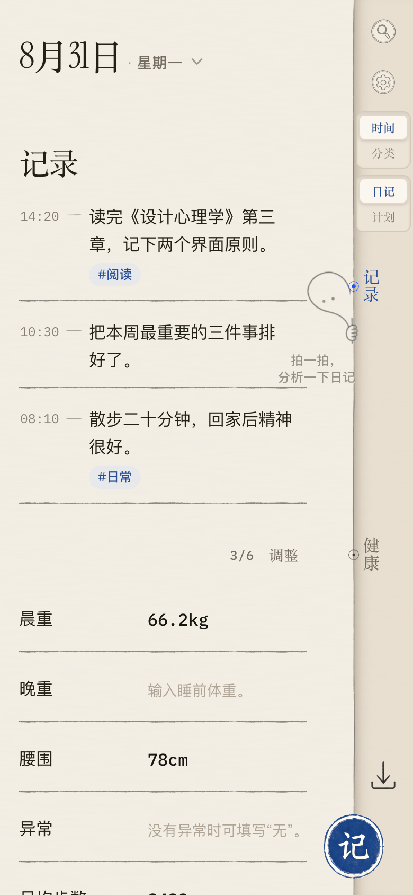
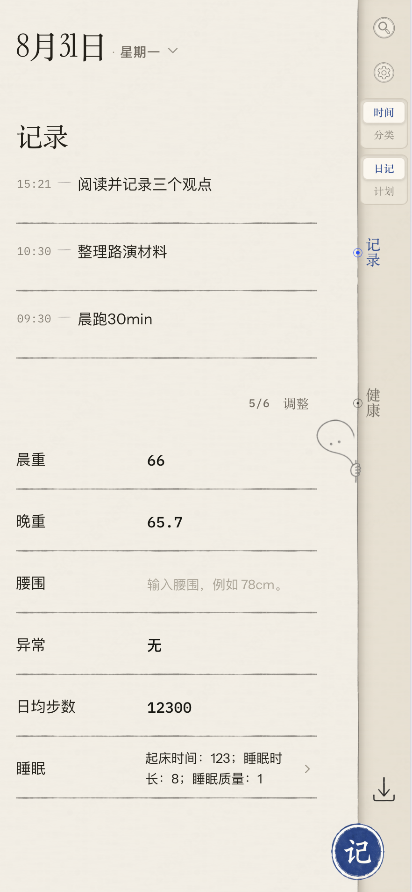
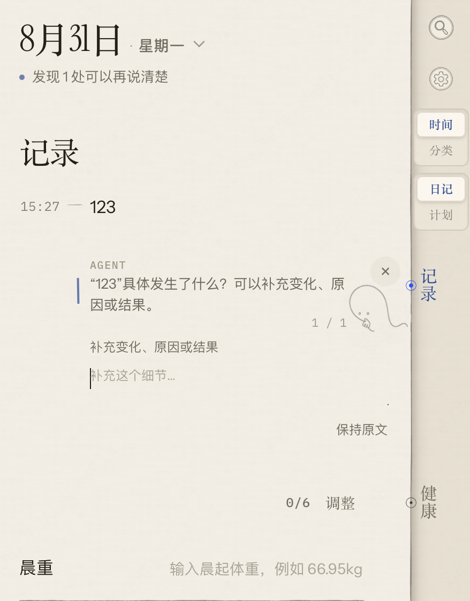
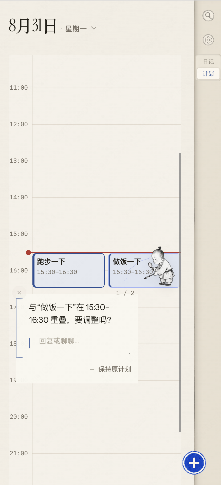
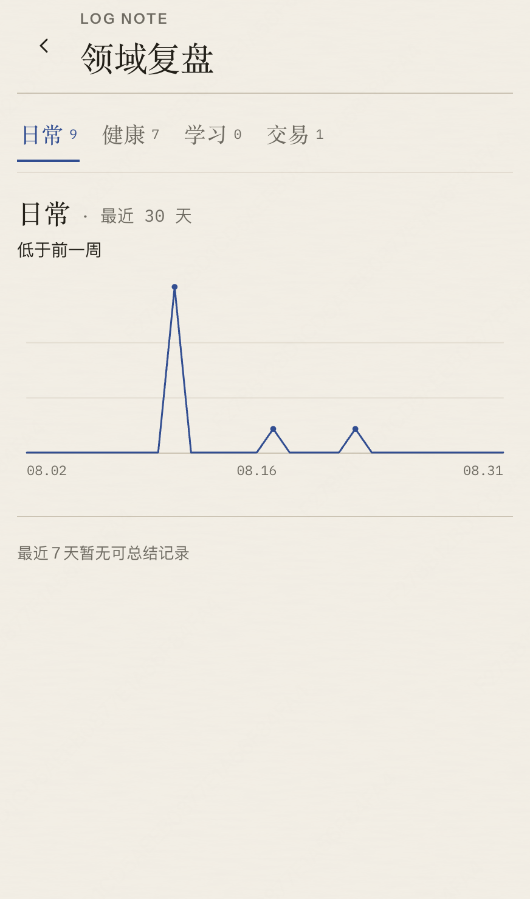
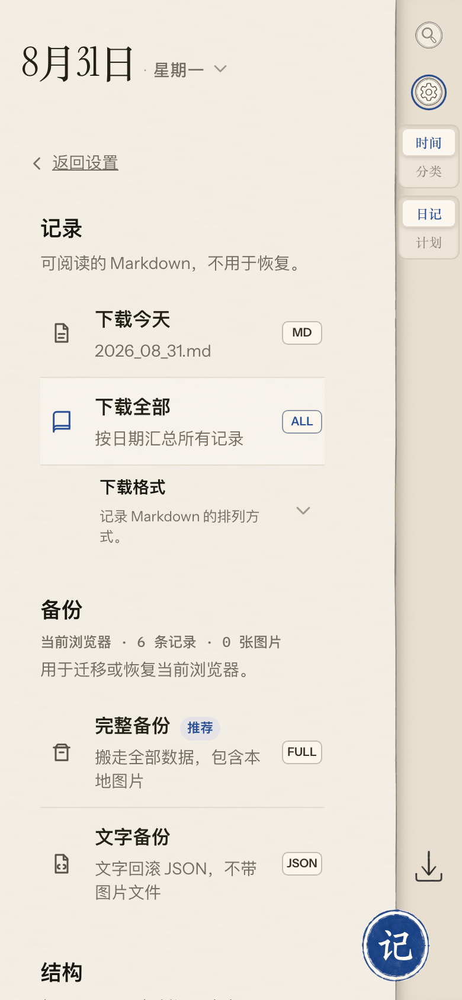

# Log Note：让日记从“记下来”走到“读懂你”

<p align="center"><strong>记录每一段时间，让长期积累逐渐长成一个熟悉你的 Agent。</strong></p>

<p align="center">
  
</p>

<p align="center"><sub>移动端首页 · 匿名演示数据</sub></p>

## 从柳比歇夫的时间日记说起

亚历山大·亚历山德罗维奇·柳比歇夫（1890—1972）是一位苏联生物学家、昆虫学家和科学思想者。根据其生平资料与格拉宁的传记《奇特的一生》，他从 1916 年开始记录时间使用，直到 1972 年去世，持续了 56 年。每天的条目很短：做了什么、用了多久；每月再汇总，每年再做一次平衡与回顾。[生平资料](https://esu.com.ua/article-59833) · [时间统计法简述](https://ldwg.ru/cards/46/) · [《奇特的一生》相关章节](https://modernlib.net/books/granin_daniil/eta_strannaya_zhizn/read)

他的“日记”更像一套关于真实时间的账本，而不是一篇修饰过的生活叙事：

- **记录事实：**不只写“今天很忙”，而是写清研究、阅读、通信、散步或休息分别发生了多久。
- **分类汇总：**把零散条目归到稳定类别，月末和年末才能看到时间真正流向哪里。
- **周期复盘：**记录不是为了给自己打分，而是用长期事实校准计划、估计与选择。

Log Note 保留了这套方法最重要的部分——先记录真实发生，再分类和复盘——但不要求每个人都成为耐心的统计员。日期、时间、搜索、分类、趋势和 Agent 都围绕同一份原始记录工作；可选结构放在次级入口，不会成为快速记录的前置条件。

## 快速了解 Log Note

Log Note 把柳比歇夫的时间记录法转译成一款移动端优先、账号隔离、离线可用的私人记录工具：你先像发消息一样记下做了什么，系统负责保存、查找和按领域回看；需要时，再主动唤醒 Diary Agent 或 Plan Agent，让它在原记录旁追问、分类或检查计划。所有会改变记录与计划的操作都要经过确认，Agent 不会在后台悄悄改写原文。

```text
快速记录 → 浏览 / 搜索 → Agent 协助澄清 → 用户确认 → 领域复盘 → 备份 / 恢复
```

当前版本已经是**可演示 MVP，但尚未正式发布**。它已经覆盖记录、浏览、搜索、编辑、删除、计划、复盘、备份和已认证离线使用；“长期领域知识库”和“熟悉你的超级 Agent”是后续方向，不是当前已经完成的能力。

## 产品如何工作

### 1. 先按时间记下来，不在记录前增加负担

首页只有一个最重要的动作：记录。点右下角的「记」，输入正文，再点「完成」即可保存。普通记录不要求先选模板、领域或分类；日期、时间、分类、标签与单张图片都放在「更多」中，需要时再补。

一天的内容可以按时间查看，也可以切到分类视图；日期标题展开月历，搜索用于找回旧记录。晨重、睡眠、步数等固定记录留在同一张开放纸面上，单值直接填写，结构化内容原地展开。

<div align="center">
  
  <br />
  <sub>图 1：先按时间记下来，不要求在记录前完成整理。</sub>
</div>

### 2. Diary Agent 在原记录旁把问题问清楚

一条普通记录可能只有一句话：

> 09:30，开完项目会，感觉推进得不太顺。

它足以保存当下，却可能不足以帮助未来的你理解现场：这是哪个项目？问题来自分工、决策还是信息？第二天是否还要继续处理？

用户主动点击书脊上的 Diary Agent 后，它会检查所选日期的普通记录，在对应原文旁一次处理一项：要么建议一个已有分类，要么提出一个具体问题。你可以回复，也可以直接保持原文。只有选择“应用分类”“补充到原记录”或“作为新记录”时，结果才会写入；分类支持撤销，切换日期、搜索、设置或页面会结束这次临时会话。

这不是让 AI 替你写日记，而是让它像一位坐在页边的编辑：原文始终在场，问题贴着来源，最终决定仍属于记录者。

<div align="center">
  
  <br />
  <sub>图 2：Agent 在原记录旁追问，由用户决定补充还是保持原文。</sub>
</div>

### 3. Plan Agent 检查下一段时间是否真的排得下

日记帮助理解已经发生的事，计划决定接下来准备做什么。Log Note 的计划页使用一条当天小时轴保存本地计划块；如果两个可编辑计划重叠，或标题含糊到无法执行，Plan Agent 会在时间线上指出具体问题。

> “跑步一下”和“做饭一下”都安排在 15:30—16:30，需要调整吗？

它可以继续询问限制和优先级，再形成标题或时间调整建议。和 Diary Agent 一样，计划不会因一次分析自动改变，只有明确确认后才会更新。Google Calendar 中已有的事件只作为只读上下文；Log Note 创建的本地计划可以在单独授权后同步。拒绝授权、离线或接口失败都不妨碍本地计划继续使用。

<div align="center">
  
  <br />
  <sub>图 3：Agent 发现真实时间冲突，并等待用户决定是否调整。</sub>
</div>

### 4. 领域复盘把散落记录变成可观察的变化

记录越来越多后，难点从“有没有保存”变成“能不能长期看懂”。Log Note 用 `Domain → Category → Template` 组织工作、学习、健康、日常等稳定领域，并提供一个本地只读的 30 天活动折线。折线中的每个点都能回到具体日期，核对当天普通记录与周期记录的数量。

它不评价自律，不计算生活分数，也不把生成内容伪装成事实。折线默认完全在本地计算；可选的最近 7 天 AI 总结需要先查看数据范围，再单独确认发送，只使用当前领域最多 80 条记录的日期、时间、正文与来源类型，结果只存在当前页面会话，不写回记录、云端或备份。

<div align="center">
  
  <br />
  <sub>图 4：把分散记录转换成可观察、可追溯的领域变化。</sub>
</div>

### 5. 找得回、改得动，也能完整带走

记录可以按日期、分类或全文搜索找回，并在原位置编辑或删除。当天与全部 Markdown 用于阅读，文字 JSON 用于回滚，便携 `.lnbackup` 会连同本地图片一起迁移；日记 Markdown 也可以按日期合并导入。所有恢复文件都会先校验，损坏、超限或不兼容的输入不会覆盖当前数据。

<div align="center">
  
  <br />
  <sub>图 5：记录可以阅读、回滚或连同本地图片一起迁移。</sub>
</div>

## 当前功能全景

| 场景 | 当前能力 | 关键边界 |
| --- | --- | --- |
| 快速记录 | 自由文本、Markdown 列表、结构化字段、数值与周期记录、单张本地图片 | 打开一次，输入后再完成一次；模板和分类不是必填 |
| 浏览与找回 | 日期时间线、月历、时间 / 分类视图、全文搜索、编辑与删除 | 原始正文不会被派生功能静默改写 |
| Diary Agent | 逐条追问、已有分类建议、回复、追加、新建、保持原文、分类撤销 | 用户主动唤醒；确认后才写入；会话不持久化 |
| 日计划 | 本地小时轴、计划新增 / 编辑 / 删除、可选 Google Calendar 只读上下文 | 本地计划离线可用；外部日历失败不删除本地内容 |
| Plan Agent | 发现本地计划重叠或含糊标题，讨论后提出调整 | 只处理可编辑本地计划；确认后才更新 |
| 领域复盘 | 本地 30 天折线、日期明细、可选 7 天 AI 总结 | 默认零请求；远程总结二次确认、会话期存在、不写回 |
| 组织结构 | `Domain → Category → Template`，支持触控、键盘和移动排序 | 不把结构维护变成快速记录步骤 |
| 备份恢复 | 当天 / 全部 Markdown、文字 JSON、结构 JSON、日记 Markdown 合并导入、便携 `.lnbackup` | 无效输入不覆盖当前数据；图片迁移使用完整备份 |
| 账号与离线 | 账号隔离缓存、云端文字文档、revision 冲突保护、PWA 壳与已认证离线使用 | 首次使用需要真实账号；图片仍留在本机与便携备份中 |

## 一次完整的使用闭环

1. 在首页点「记」，输入一条记录并点「完成」。
2. 点日期打开月历，或点右侧搜索，找回刚才或更早的记录。
3. 可选：唤醒 Diary Agent，回答一个具体问题或确认一个已有分类。
4. 切到计划页，让 Plan Agent 检查当天的重叠与含糊计划。
5. 从当前领域进入复盘，查看最近 30 天趋势并回到某天核对原文。
6. 打开「设置 → 保存文件」，下载当天 Markdown 和一份完整备份。

## 数据、隐私与可逆性

- **账号隔离：**每个账号使用独立的 `localStorage` 文字缓存和 IndexedDB 图片命名空间；Supabase 文档通过 RLS 按 `auth.uid()` 隔离。
- **本地先写：**记录、计划、结构和设置先保存到本地，再通过 revision compare-and-swap 自动同步；旧 revision 会暂停同步，不会覆盖另一台设备的新版本。
- **图片留在本机：**支持 JPEG、PNG、WebP，单张最多 `5 MiB`、每个本地账号最多 `50 MiB`。云端文字文档不保存图片字节；迁移图片请使用完整 `.lnbackup`。
- **AI 必须显式触发：**Diary / Plan Agent 与 7 天领域总结都由用户主动开始；远程请求失败时保留本地能力，不后台扫描、不自动保存，也不改写原文。
- **删除和迁移可控：**坏备份不覆盖好数据，AI 结果不进入备份；分类改变可撤销，长期知识能力未来也必须提供来源、删除、导出和停用边界。

RLS 提供账号级访问隔离，但不等同于端到端加密。使用真实敏感记录前，请先确认部署环境、备份和数据边界符合要求。

## 后续计划

### 近期：先把“可以演示”变成“可以长期放心使用”

当前优先级不是继续堆功能，而是完成真实发行基线：验证获批账号体系、首次云端创建、双账号 RLS、跨设备 revision 冲突、已认证离线、备份恢复和部署回滚；同时完成 14 天自然使用，确认快速记录、Agent 追问与领域复盘确实会被持续使用。通过这些闸门之前，项目仍保持“可演示 MVP，尚未正式发布”。

### 中期方向：建立可追溯的个人领域知识库

下一阶段希望把**用户明确确认过**的记录、分类、上下文与处理结果沉淀为个人领域知识。它不应只是把全部日记塞给模型，而要保留来源日期、原文链接、适用领域、用户确认和撤销状态，让任何长期结论都能回到证据。

这项能力尚未实现，也没有进入当前数据模型。正式开始前必须单独完成产品、隐私、账号隔离、离线、同步冲突、备份兼容和删除 / 导出设计；未通过这些准入条件时，它会保持隔离，不进入主记录链路。

### 长期愿景：每个人都有一个熟悉自己的超级 Agent

通用 AI 每次对话都像重新认识你一次。真正有用的个人 Agent 应当知道：过去发生过什么、尝试过什么、哪些办法曾经有效、哪些计划总被现实打断，以及你长期重视什么。

未来，当你制定计划或遇到问题时，它可以从自己的领域历史中找到类似经历和可核对依据，再提出更贴合个人节奏的建议。但它仍然不替你决定生活：原始记录由你拥有，长期记忆可以查看、删除和带走，任何会改变记录、计划或知识库的动作都要经过确认。

我们想做的不是一个替你生活的 AI，而是一个随着记录一起成长、越来越懂得如何与你共同回顾、思考和行动的 Agent。

## 当前状态

- **产品状态：**可演示 MVP，尚未正式发布。
- **自动验证：**记录、Agent、计划、领域复盘、PWA、构建和数据保护已有自动化覆盖；最新证据以 [PROJECT_BOARD.md](PROJECT_BOARD.md) 为准。
- **代码结构：**路由、私有组件、共享 UI 与模型边界见 [ARCHITECTURE.md](ARCHITECTURE.md)，其中 Next.js App Router 约定优先于辅助分层模式。
- **人工验证缺口：**真实账号首次同步、跨设备冲突、双账号隔离、正式部署，以及 Agent / 领域复盘的 14 天自然使用效用仍待完成。

## 本地运行

要求：可运行本项目依赖的 Node.js、npm，以及一个 Supabase 兼容项目。

```bash
npm install
cp .env.example .env.local
npm run dev
```

打开 [http://127.0.0.1:3100](http://127.0.0.1:3100)。开发命令固定使用 loopback 地址和端口 `3100`，避免多个 IPv4 / IPv6 进程共享同一份 Next.js 构建产物。

在 `.env.local` 中至少填写：

```dotenv
NEXT_PUBLIC_SUPABASE_URL=https://YOUR_SUPABASE_COMPATIBLE_ENDPOINT
NEXT_PUBLIC_SUPABASE_PUBLISHABLE_KEY=YOUR_PUBLISHABLE_KEY
```

随后按文件名顺序执行 `supabase/migrations/` 中的 SQL。已经执行过初始文档迁移的项目，也必须执行 `20260816170000_require_expected_revision.sql`，以关闭 `NULL` expected-revision 绕过 CAS 的边界。

可选配置：

| 变量 | 用途 |
| --- | --- |
| `NEXT_PUBLIC_LOG_NOTE_AUTH_MODE` | 公共构建保持 `standard`；仅获批的美团内部构建使用 `meituan-sso` |
| `NEXT_PUBLIC_GOOGLE_CALENDAR_CLIENT_ID` | 启用单独授权的 Google Calendar 连接 |
| `DEEPSEEK_API_KEY` / `DEEPSEEK_MODEL` / `DEEPSEEK_BASE_URL` | 服务端智能整理；不配置时，分类使用本地规则、日记复盘使用本地时间线降级 |

生产构建：

```bash
npm run build
npm start
```

## 验证

新机器先安装项目锁定的 Chromium：

```bash
npx playwright install chromium
```

运行完整质量门禁：

```bash
npm run check
```

门禁依次覆盖设计规范、单元测试、移动端浏览器回归、PWA 安装 / 离线 / 持久化 / 更新、生产构建和 `git diff --check`。当前验收状态与仍需人工验证的真实会话边界，以 [PROJECT_BOARD.md](PROJECT_BOARD.md) 为准。

## 技术栈

- Next.js 15、React 19
- Supabase Auth / Postgres / RLS
- localStorage、IndexedDB、Service Worker、PWA
- Playwright、Node.js Test Runner
- 可选 DeepSeek 分类与 Google Calendar 连接

## 开发协作

新功能从 `PROJECT_BOARD.md` 中一个既有 `LN-###` 条目开始，使用仓库内 Spec Kit `0.16.5` 工作流细化，不创建第二份竞争待办：

```text
$speckit-specify → $speckit-clarify（需要时）→ $speckit-plan
→ $speckit-checklist（需要时）→ $speckit-tasks → $speckit-analyze
```

项目边界见 [product.md](product.md)，视觉与交互约束见 [DESIGN.md](DESIGN.md)，任务优先级、依赖和验收证据见 [PROJECT_BOARD.md](PROJECT_BOARD.md)。
