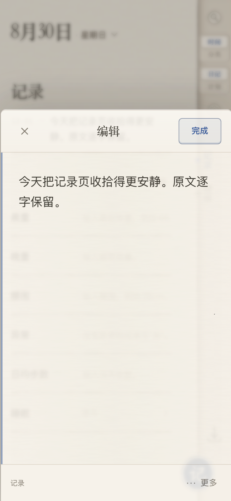
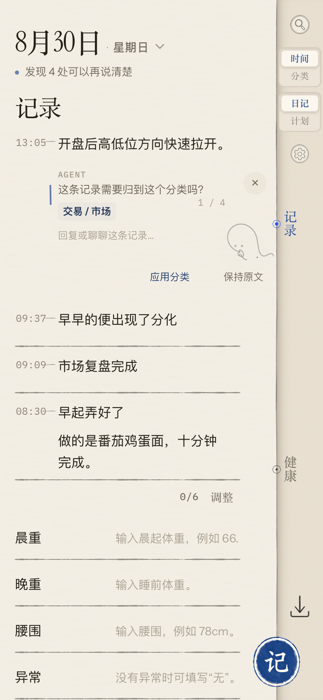

# Log Note

> **快速记下，随时找回。**

Log Note 是一款移动端优先、账号隔离、离线可用的私人记录工具。它先把最重要的循环做好：灵感和事件还新鲜时，用最少的决定写下来；之后能按日期或分类浏览、搜索、修改、删除、备份并恢复。

```text
快速记录 → 浏览 → 搜索 → 编辑 / 删除 → 备份 / 恢复 → 离线继续
```

当前版本是**可演示 MVP，尚未正式发布**。首次使用需要真实的 Supabase 兼容账号；设备完成过认证后，即使网络不稳定，也能继续使用该账号自己的本地缓存。原始记录不会被 AI、迁移或派生能力静默改写。

## 功能示范｜三步看懂如何使用

> 展示建议：在 Git 页面把浏览器宽度调整到 `1100–1280px`，从本标题开始截图，可一次呈现完整的三步使用流程。

<table>
  <thead>
    <tr>
      <th width="33%">① 写下来</th>
      <th width="33%">② 回看并整理</th>
      <th width="33%">③ 备份带走</th>
    </tr>
  </thead>
  <tbody>
    <tr>
      <td align="center"></td>
      <td align="center"></td>
      <td align="center"></td>
    </tr>
    <tr>
      <td><strong>点「记」→ 输入 → 完成</strong><br />普通记录只需一次打开、一次保存；分类、标签和图片都留在「更多」里，不打断快速记录。</td>
      <td><strong>点书脊角色 → 查看问题 → 明确确认</strong><br />Agent 只在当前记录旁给出问题或已有分类建议；「应用分类」和「保持原文」都由用户决定。</td>
      <td><strong>设置 → 保存文件 → 选择格式</strong><br />Markdown 用于阅读，JSON 用于文字恢复，完整 <code>.lnbackup</code> 可连同本地图片一起迁移。</td>
    </tr>
  </tbody>
</table>

### 90 秒演示脚本

1. 在首页点右下角「记」，输入一条记录并点「完成」。
2. 点日期打开月历，或点右侧搜索，找回刚才或更早的记录并重新编辑。
3. 可选：唤醒日记 Agent，查看问题或分类建议；不确认就不写入。
4. 打开「设置 → 保存文件」，下载当天 Markdown，再下载一份完整备份。

## 当前实现与验证状态

| 场景 | 当前能力 |
| --- | --- |
| 快速记录 | 自由文本、结构化字段、数值记录、周期记录、Markdown 列表输入、单张本地图片 |
| 浏览与找回 | 日期时间线、月历、领域 / 分类视图、全文搜索、编辑与删除 |
| 组织结构 | `Domain → Category → Template`，支持触控、键盘和移动菜单排序 |
| 计划与复盘 | 本地日计划、可选 Google Calendar 上下文；本地只读 30 天领域复盘仍在产品验证中 |
| 可选 Agent | 用户主动触发；在原记录旁追问，或把记录建议到一个已有分类；当前仍在产品验证中 |
| 迁移与恢复 | 当天 / 全部 Markdown、日记 Markdown 合并导入、完整 JSON、结构 JSON、便携 `.lnbackup` |
| 离线使用 | PWA 安装、应用壳缓存、已认证设备离线记录与刷新持久化 |

## 数据与隐私边界

- **账号隔离：**每个账号使用独立的 `localStorage` 文本缓存和 IndexedDB 图片命名空间；Supabase 文档通过 RLS 按 `auth.uid()` 隔离。
- **本地先写：**记录、计划、结构和设置先落到本地，再通过 revision compare-and-swap 自动同步；遇到旧 revision 会暂停同步，不会直接覆盖另一台设备的新版本。
- **图片留在本机：**支持 JPEG、PNG、WebP，单张最多 `5 MiB`、每个本地账号最多 `50 MiB`。文字云文档不存图片字节；迁移图片请使用完整 `.lnbackup`。
- **AI 必须显式触发：**服务端 DeepSeek 是可选配置。它只能在给定的已有分类中建议，不创建分类或标签，不后台运行，不自动保存，也不改写原文。
- **坏备份不覆盖好数据：**导入内容会先校验；无效、损坏或不兼容的输入不会替换当前记录。

RLS 提供账号级访问隔离，但不等同于端到端加密。使用真实敏感记录前，请先确认部署环境、备份和数据边界符合你的要求。

## 本地运行

要求：可运行本项目依赖的 Node.js、npm，以及一个 Supabase 兼容项目。

```bash
npm install
cp .env.example .env.local
npm run dev
```

打开 [http://127.0.0.1:3100](http://127.0.0.1:3100)。开发命令固定使用 loopback 地址和端口 `3100`，避免多个 IPv4 / IPv6 进程共享同一份 Next.js 构建产物。

在 `.env.local` 中至少填写：

```dotenv
NEXT_PUBLIC_SUPABASE_URL=https://YOUR_SUPABASE_COMPATIBLE_ENDPOINT
NEXT_PUBLIC_SUPABASE_PUBLISHABLE_KEY=YOUR_PUBLISHABLE_KEY
```

随后按文件名顺序执行 `supabase/migrations/` 中的 SQL。已经执行过初始文档迁移的项目，也必须执行 `20260816170000_require_expected_revision.sql`，以关闭 `NULL` expected-revision 绕过 CAS 的边界。

可选配置：

| 变量 | 用途 |
| --- | --- |
| `NEXT_PUBLIC_LOG_NOTE_AUTH_MODE` | 公共构建保持 `standard`；仅获批的美团内部构建使用 `meituan-sso` |
| `NEXT_PUBLIC_GOOGLE_CALENDAR_CLIENT_ID` | 启用单独授权的 Google Calendar 连接 |
| `DEEPSEEK_API_KEY` / `DEEPSEEK_MODEL` / `DEEPSEEK_BASE_URL` | 服务端智能整理；不配置时，分类使用本地规则、日记复盘使用本地时间线降级 |

生产构建：

```bash
npm run build
npm start
```

## 验证

新机器先安装项目锁定的 Chromium：

```bash
npx playwright install chromium
```

运行完整质量门禁：

```bash
npm run check
```

门禁依次覆盖设计规范、单元测试、移动端浏览器回归、PWA 安装 / 离线 / 持久化 / 更新、生产构建和 `git diff --check`。当前验收状态与仍需人工验证的真实会话边界，以 [PROJECT_BOARD.md](PROJECT_BOARD.md) 为准。

## 技术栈

- Next.js 15、React 19
- Supabase Auth / Postgres / RLS
- localStorage、IndexedDB、Service Worker、PWA
- Playwright、Node.js Test Runner
- 可选 DeepSeek 分类与 Google Calendar 连接

## 开发协作

新功能从 `PROJECT_BOARD.md` 中一个既有 `LN-###` 条目开始，使用仓库内 Spec Kit `0.16.5` 工作流细化，不创建第二份竞争待办：

```text
$speckit-specify → $speckit-clarify（需要时）→ $speckit-plan
→ $speckit-checklist（需要时）→ $speckit-tasks → $speckit-analyze
```

项目边界见 [product.md](product.md)，视觉与交互约束见 [DESIGN.md](DESIGN.md)，任务优先级、依赖和验收证据见 [PROJECT_BOARD.md](PROJECT_BOARD.md)。
